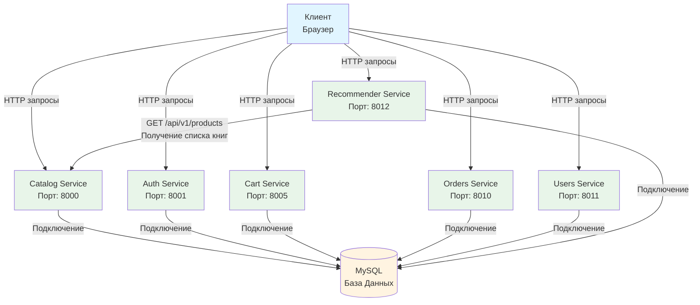

# Диаграмма микросервисной архитектуры проекта

## Визуальная схема архитектуры

## Описание архитектуры

### Компоненты системы

1. **Клиент (Браузер)** - точка входа для всех пользовательских запросов
2. **Catalog Service** (порт 8000) - управление каталогом виниловых пластинок
3. **Auth Service** (порт 8001) - аутентификация и авторизация пользователей
4. **Cart Service** (порт 8005) - управление корзиной покупок
5. **Orders Service** (порт 8010) - обработка заказов
6. **Users Service** (порт 8011) - управление пользователями
7. **Recommender Service** (порт 8012) - AI-рекомендации и чат-консультант
8. **MySQL Database** - единая база данных для всех сервисов

### Потоки данных

1. **Клиент → Сервисы**: Все сервисы принимают HTTP запросы от клиента
2. **Сервисы → База Данных**: Все сервисы используют единую MySQL базу данных для хранения данных
3. **Recommender → Catalog**: Сервис рекомендаций обращается к каталогу для получения списка пластинок через эндпоинт `GET /api/v1/products`

### Особенности

- Все сервисы работают независимо друг от друга
- Единая база данных MySQL обеспечивает консистентность данных
- Recommender Service использует Catalog Service для получения актуального списка товаров при генерации рекомендаций
